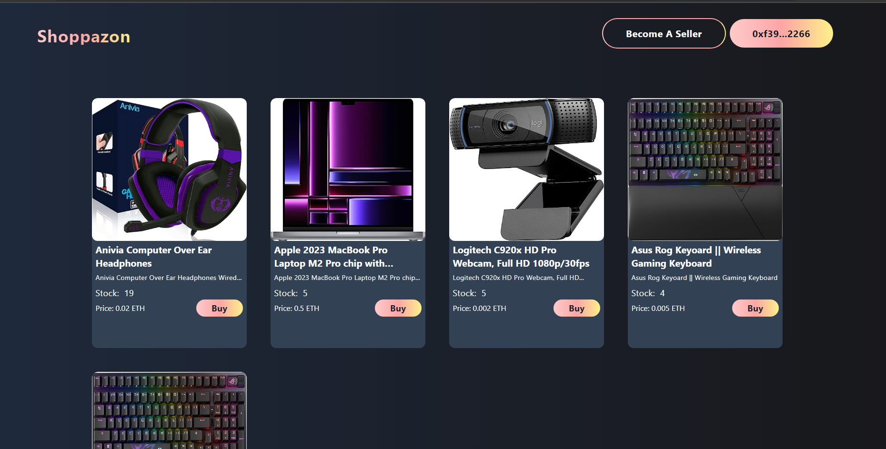

# Shoppazon - Blockchain-Based Shopping Platform

## About
Shoppazon is a blockchain-powered shopping platform on Ethereum's Sepolia testnet. With React JS, Solidity, Ethers JS and Tailwind CSS for innovative design, it offers a seamless and secure shopping experience. Whether exploring products or becoming a seller, Shoppazon ensures transparency in every transaction. As an open-source project, it showcases my expertise as a blockchain developer, uniting technology and commerce in a new way. Discover the future of shopping with Shoppazon—where blockchain transforms the online marketplace.

## Features
- Explore Products: Delve into a curated selection of items where technology meets shopping excitement.
- Decentralized Shopping: Immerse yourself in a secure and transparent shopping realm driven by blockchain.
- User-Friendly Design: Navigate intuitively through the platform, ensuring a seamless interaction.
- Become a Seller: Unleash your entrepreneurial spirit by listing your own products.
- Product Management: Edit and delete listings to curate your offerings effortlessly.

## Getting Started
To begin your journey with Shoppazon, follow the guidelines provided in the README.md files within each folder:

- [smart-contract/README.md](./smart-contract/README.md): Deploy the smart contract underpinning Shoppazon's innovation.
- [client/README.md](./Shoppazon/README.md): Run the client application and explore the dynamic features that define this platform.

##  Connect with Me
Whether you're curious, have feedback, or simply want to chat about Shoppazon, I'm here. Explore more of my work and portfolio at [https://talhasaddique.netlify.app](https://talhasaddique.netlify.app) or [https://linktr.ee/TalhaSaddique](https://linktr.ee/TalhaSaddique).
, where my journey as a developer unfolds.

## Dive Deeper into the Experience
Thank you for embarking on this journey through Shoppazon. It's a testament to my blockchain capabilities and a vision of what shopping could become. To delve deeper into my journey, visit [https://talhasaddique.netlify.app](https://talhasaddique.netlify.app) or [https://linktr.ee/TalhaSaddique](https://linktr.ee/TalhaSaddique).
